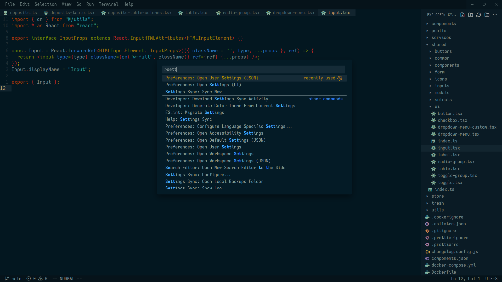

# NOVASOLARIZED

novasolarized vscode color theme.

dark colorscheme for vscode based on:
[Solarized](https://ethanschoonover.com/solarized) and [NeoSolarized](https://github.com/overcache/NeoSolarized).

## License

[MIT License](LICENSE)