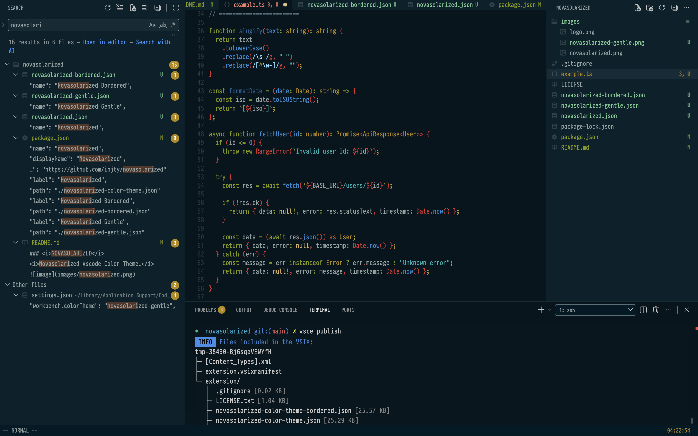
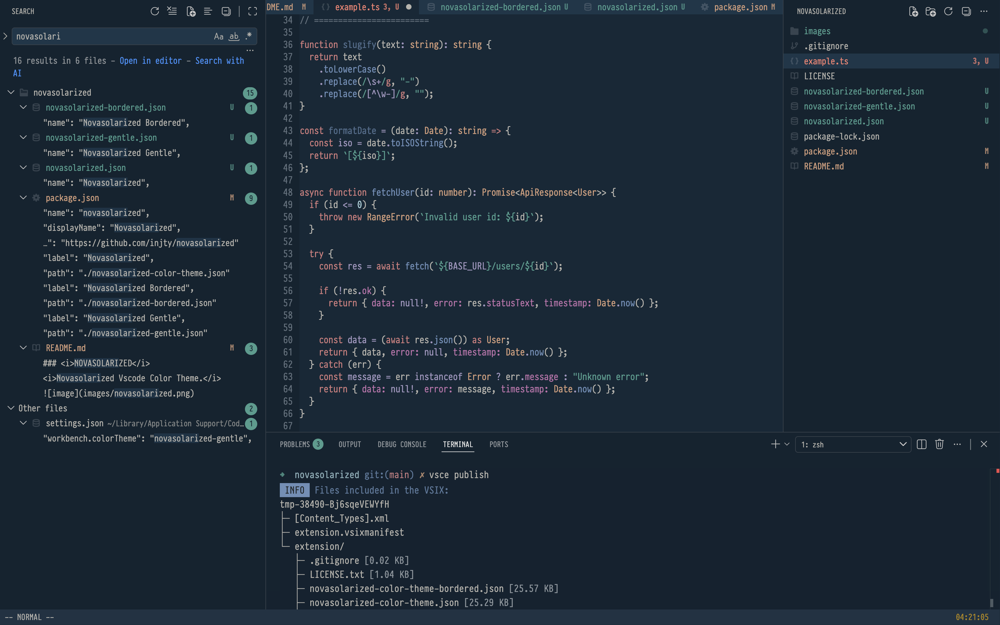

### <i>NOVASOLARIZED</i>

<i>Novasolarized Vscode Color Theme.</i>

<i>dark colorscheme for vscode based on:
[Solarized](https://ethanschoonover.com/solarized), [NeoSolarized](https://github.com/overcache/NeoSolarized), [Gentle Dark](https://github.com/gentlelionstudios/gentle-dark-zed)
</i>

#### <i>License</i>

<i>[MIT License](LICENSE)</i>

#### <i>More Extentions:</i>
<i>You can also check: [NovaQuick](https://marketplace.visualstudio.com/items?itemName=injty.novaquick) and [NovaClock](https://marketplace.visualstudio.com/items?itemName=injty.novaclock).</i>